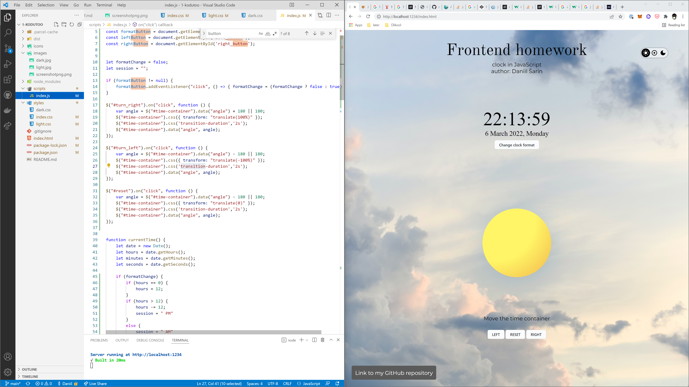

# 1 Homework

---

Greeny Link: [https://greeny.cs.tlu.ee/~dansar/FrontendDevelopment/](https://greeny.cs.tlu.ee/~dansar/FrontendDevelopment/)

Author: Daniil Šarin

Funktsionaalsus: saate valida kas heleda või tumeda või süsteemse teema; Kella vormingu muutmine: 12 või 24 tundi; Liigutada kellakonteinerit vasakule, paremale ja tagasi.