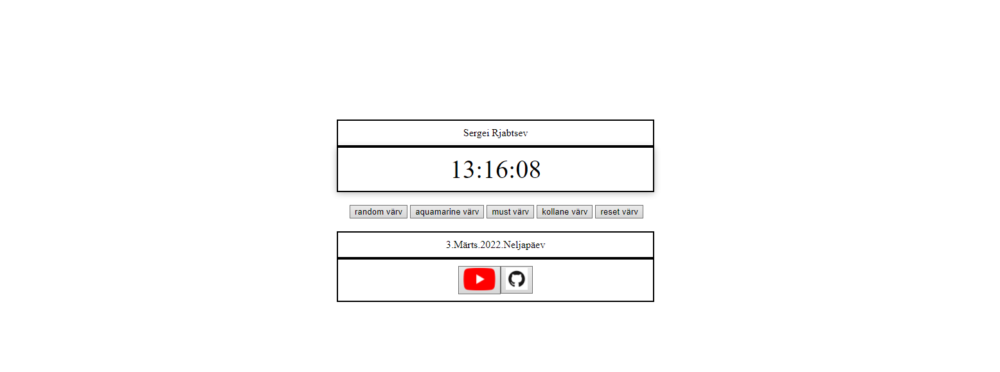

# 1 Kodutöö - elektrooniline kell

## Filipp-Artur Pljassunov

### Fuktsionaalsus:

- Tausta ja numbrite värvi muutumine (valge/tume)
- Numbrite suuruse muutumine
- Kellaformaadi muutumine (12/24h)
- Keele muutumine (eesti/inglise)
